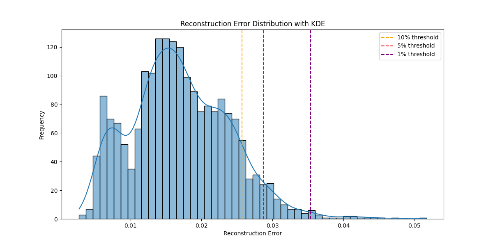
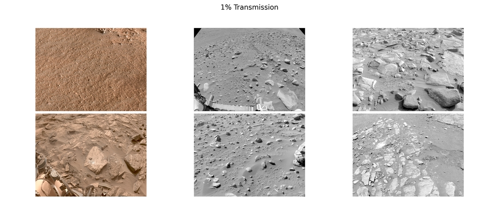
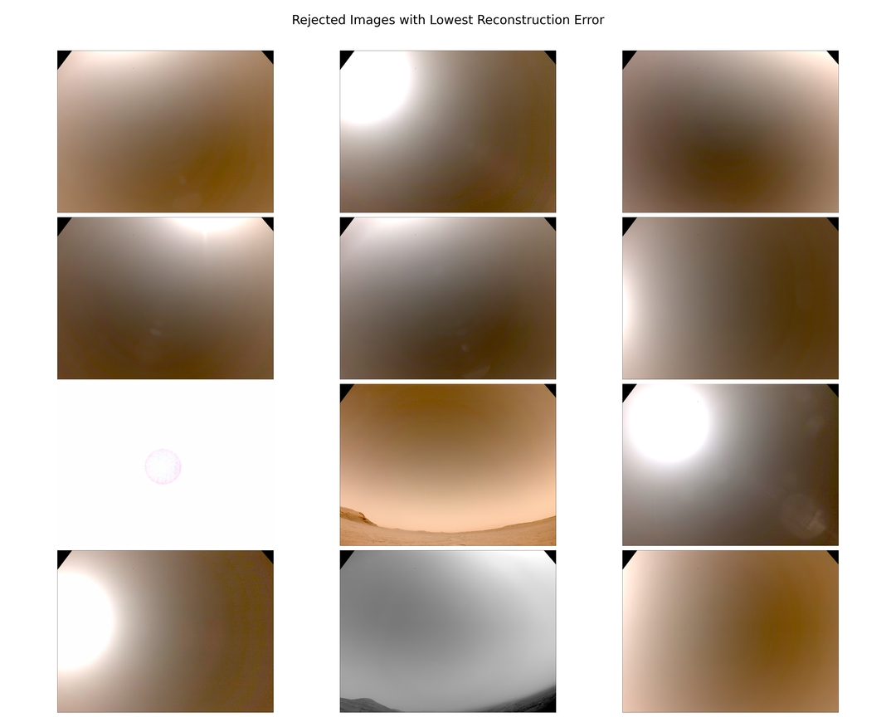
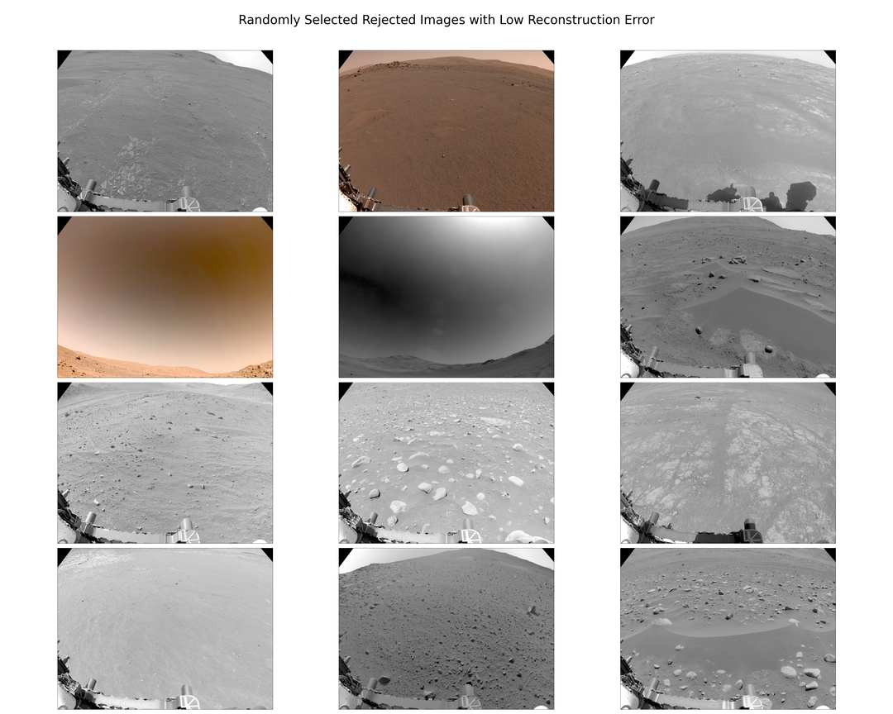

# 🚀 Svetovid Labs - Edge AI for Onboard Data Prioritization (Anomaly Detection)

**🌐 Project website: [svetovid.dev](https://svetovid.dev/)**

This project presents a proof-of-concept Edge AI system designed for **onboard data prioritization and selective transmission** in bandwidth-constrained environments, such as planetary missions.

The system simulates how spacecraft (or other edge devices) can automatically select and transmit only the most valuable data using anomaly detection.

---

## 🧠 Problem

Modern space missions generate massive amounts of visual data, while communication bandwidth remains extremely limited.

As a result:

* most data cannot be transmitted,
* valuable observations may be delayed or lost,
* manual prioritization is not scalable.

---

## 💡 Solution

This project implements an **onboard AI pipeline** that:

1. Processes incoming images
2. Computes anomaly scores using an autoencoder
3. Ranks images by importance
4. Simulates selective transmission under bandwidth constraints

---

## 📊 Results

The figures below come from the full experiment (~50k images). The repository
includes only a small sample dataset — running the demo pipeline on it will
produce different numbers (see Quick Start).

### Reconstruction Error Distribution


The distribution shows a clear long tail, enabling percentile-based thresholding.

### Example Outputs

**Top anomalies (selected for transmission - 1%):**


High-error samples correspond to visually distinct or rare scenes

**Lowest-error images (rejected):**



**Random Low-error images (rejected):**


### Key Metrics

- Inference throughput: ~11 images/sec
- Avg latency: ~0.088 s/image
- Data reduction: up to 99%

---

## ⚙️ Pipeline Overview

```
train.py                  # train the autoencoder (MLflow-tracked)
↓
run_inference.py          # score images by reconstruction error
↓
simulate_transmission.py  # simulate bandwidth-constrained selection
↓
generate_report.py        # build visual reports
```

---

## 📊 Features

* Autoencoder-based anomaly detection
* Image prioritization using reconstruction error
* Simulation of transmission scenarios (10% / 5% / 1%)
* Performance metrics (inference time, throughput)
* Visual reports and plots
* MLflow experiment tracking
* Unit test suite and Docker support

---

## ▶️ Quick Start

### 1. Clone and install

```
git clone https://github.com/pevu97/SvetovidLabs.git
cd SvetovidLabs
pip install -r requirements.txt
```

### 2. Run the demo pipeline

The repository ships with a trained model (`best_autoencoder.pth`) and a small
sample dataset, so you can run the full pipeline immediately:

```
python run_inference.py
python simulate_transmission.py
python generate_report.py
```

Each step feeds the next: `run_inference.py` scores every image in `data/`,
`simulate_transmission.py` ranks them and simulates 10/5/1% transmission, and
`generate_report.py` builds the plots and tables.

> **Note:** the sample set contains ~30 images, so the numbers you get will
> differ from the figures shown above, which come from the full ~50k-image
> experiment. The demo verifies that the pipeline runs end-to-end — it is not
> meant to reproduce the published metrics.

### 3. (Optional) Train from scratch

```
python train.py --data-dir data --epochs 40
mlflow ui --backend-store-uri sqlite:///mlflow.db
```

---

## 📈 Output

After running the pipeline:

**`inference results/`** — inference_records.json, inference_summary.json

**`simulation results/`** — scenario_10pct.csv, scenario_5pct.csv, scenario_1pct.csv, selected image folders, transmission_summary.json

**`report/`** — histograms, comparison tables, selected/rejected image visualizations

> Re-running the pipeline overwrites the CSV and JSON outputs, but the
> `selected_*pct/` image folders accumulate copies. Delete `simulation results/`
> between runs if you want a clean slate.

---

## 🧪 Tests

```
pip install -r requirements-dev.txt
pytest
```

Unit tests cover the model contract (shapes, output range, latent compression,
checkpoint round-trip), the reconstruction-error metric, and dataset loading.

---

## 🔬 Experiment Tracking

Every training run logs to MLflow (local SQLite backend, `mlflow.db`):

* full training configuration (lr, weight decay, scheduler, augmentation, split, seed),
* train/val L1 loss and learning rate per epoch,
* anomaly threshold (val mean + 3*std) and held-out test error statistics,
* best checkpoint, loss curve and thresholds.json as artifacts.

Inspect runs with:

```
mlflow ui --backend-store-uri sqlite:///mlflow.db
```

---

## 🐳 Docker

```
docker build -t svetovid .
docker run --rm -v $(pwd)/data:/app/data -v $(pwd)/"inference results":/app/"inference results" svetovid
```

---

## 🧹 Dataset Curation Pipeline

The autoencoder is trained only on *curated nominal* NAVCAM frames. Raw NASA imagery
goes through a multi-stage cleaning pipeline (`scripts/data_prep/`):

```
raw NAVCAM images
↓  remove_duplicates.py        # exact duplicates (SHA-256) + near-duplicates
                               # (perceptual hash, sliding window, distance <= 2)
↓  filter_aspect_ratio.py      # remove panoramic frames (aspect ratio >= 2.0)
↓  train_rover_classifier.py   # MobileNetV3-Small (transfer learning) trained to
   predict_rover_classifier.py # detect frames dominated by the rover's own hardware
↓  segregate_by_confidence.py  # triage: acceptable / rover_heavy / uncertain
                               # (confidence thresholds 0.75 / 0.25)
= curated "acceptable" training set
```

Why it matters: an autoencoder trained on noisy data learns to reconstruct the noise.
Removing duplicates prevents train/val leakage, and filtering rover-heavy frames with a
dedicated binary classifier keeps the "nominal terrain" distribution clean — so that at
inference time high reconstruction error genuinely signals *novel content*, not a wheel
in the corner of the frame.

---

## 🧪 Dataset

The model was developed and evaluated using images from NASA's Perseverance rover
(Mars 2020 mission), specifically NAVCAM (Navigation Camera) data.

**Characteristics**

- Source: NASA PDS Imaging Atlas
- Camera: NAVCAM (left/right)
- Image type: mostly grayscale navigation images
- Resolution: typically ~1024×1024 (resized to 256×256 for training)
- Dataset size: ~50,000 images (filtered and deduplicated)

**Reproducing full-scale experiments**

The repository ships only a small sample dataset. To replicate results at full
scale or extend the dataset, download additional NAVCAM images directly from the
official NASA PDS Imaging Atlas — the full dataset is not hosted here due to size
constraints.

---

## ⚡ Performance

* ~11 images/sec inference throughput
* ~0.088 s per image
* up to **99% data reduction**

---

## 🛰️ Use Cases

* Planetary missions (Mars rovers, orbiters)
* Autonomous satellites
* Remote sensing systems
* Edge AI systems
* Drone-based exploration

---

## 🚧 Future Work

* Edge deployment (embedded hardware)
* Multi-modal data
* Real-time processing
* Improved anomaly detection (SSIM / latent-space metrics alongside L1)
* CI pipeline (GitHub Actions) running the test suite

---

## 📬 Contact

Author: **Patryk Wieczorek**
Website: [svetovid.dev](https://svetovid.dev/)
GitHub: [github.com/pevu97](https://github.com/pevu97)

---

## 📄 License

Research / demonstration purposes.
